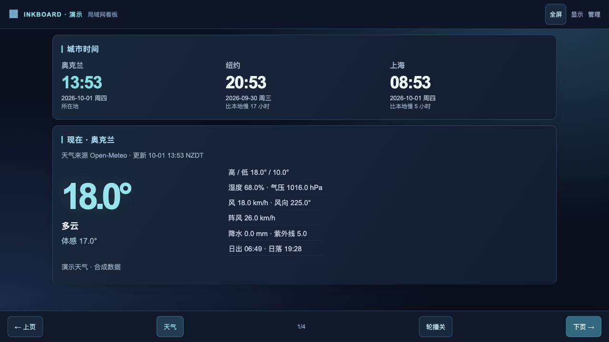

# InkBoard · 墨水屏天气与飞牛 NAS 看板

面向 Kindle Voyage、闲置手机和 iPad 的局域网常驻看板。电脑端管理与设备设置采用彩色控制台，设备页提供模式、字号和轮播效果预览；资源随应用打包，局域网使用不依赖外部 CDN。Kindle 和彩色看板使用独立入口。Go 服务、服务端 HTML、轻量脚本，无外部字体或 CDN。默认中文、摄氏度、24 小时制。

**当前为 0.1.0-alpha.1 预览版。** 可运行服务、两种架构的原生 FPK、Docker 运行方式及自动测试已准备。飞牛、Kindle Voyage、iOS 15 和 Android 的实机验收仍待完成，尚未上架市场。见 [验收记录](docs/验收记录.md)。

[下载预览安装包](https://github.com/XLARIC/inkboard-fnos/releases/tag/v0.1.0-alpha.1) · [验收记录](docs/验收记录.md)

## 功能

- 所在地及可配置城市的日期、星期、时间和相对时差，服务端按 IANA 时区处理夏令时。初始时钟为纽约、上海，可在电脑网页增删、排序，最多 8 个。
- 管理页与设备页提供两组本地生成的二维码、完整链接、复制和直接打开；Kindle 黑白入口 /basic，手机／iPad／PC 彩色入口 /?mode=mobile。
- 所在地支持详细地址、经纬度及 IANA 时区。地址文字保存在 NAS，不发送给天气服务；可选自建或授权的 Nominatim 兼容地址服务，默认关闭。
- 当前天气、体感、湿度、气压、风向风速、阵风、降水、今日高低温、紫外线、日出日落。
- 今日每三小时摘要；昨天、今天、未来 15 天的 17 日概览；点击日期进入完整逐小时详情。昨日明确标为模型数据回顾。
- 每台 NAS 一个主屏：CPU、内存、GPU、运行时间、网络、磁盘读写、温度和风扇。
- **存储空间和物理磁盘分别显示。** 存储空间显示容量、使用率与文件系统；物理磁盘包含系统盘、外接盘和未加入存储空间的磁盘，显示内置／外接、型号、接口、容量、健康、温度。分区、循环设备和 RAID／设备映射不重复计数。
- 高配 NAS 关机后保留最后快照；实时指标显示 —。历史快照在独立、明确标识的页面查看，不参与轮播。连续三次连接失败后显示离线，重试放缓至最长两分钟，开机自动恢复。凭据失效、证书异常和采集异常分别显示。

显示设备只连接主端，配对凭据不下发浏览器。NAS 之间使用 HTTPS、配对凭据和证书指纹校验。管理操作要求登录和跨站请求校验。

## 飞牛安装

1. 下载对应架构的 FPK，在应用中心手动安装。Intel／AMD 选择 amd64（manifest 为 x86），ARM64 选择 arm64（arm）。
2. 常开 NAS 选择「主端」，默认不添加任何 NAS、不采集硬件。定期关机 NAS 选择「仅采集器」。
3. 默认页面端口 18888、采集端口 18889；更改页面端口后采集接口使用下一端口，因此页面端口最大 65534。
4. 向导设置至少 12 字节的管理密码。打开桌面管理入口，或 http://NAS局域网IP:18888/admin，搜索选择城市。受信任 HTTPS 和支持的浏览器可选定位；约 1 公里精度的经纬度交给 Open-Meteo 查询时区，填入表单后再确认保存。核心局域网 HTTP 保留手动选择。
5. 电脑端管理页可添加本机 NAS，或下载采集器安装脚本，在另一台飞牛执行。脚本通过官方 appcenter-cli 安装同一 FPK，交互输入密码并校验安装包。也可用应用中心手动安装。高配 NAS 管理页生成配对码；主端网页粘贴配对码，验证并添加。
6. Kindle 打开主端的 /basic；现代设备打开 /?mode=mobile。电脑管理页可扫码、复制链接或直接打开。查看免登录，共享配置修改需要管理员登录。

不要注册公网网关或设置公网端口转发。应用按直连客户端 IP 限制私有／回环来源，忽略转发来源头；访问地址须为局域网 IP 或 localhost。若放在反向代理后，代理也必须限制局域网访问。

配置及本机密钥位于官方 TRIM_PKGETC，缓存和备份位于 TRIM_PKGVAR。升级前备份配置与密钥，保持城市、NAS、密码和自定义端口。卸载脚本不删除数据；**飞牛卸载界面也需保留应用数据**，否则系统可能清理。备份含密钥，应按私密文件保存。

网页和采集 HTTPS 服务以专用用户运行。独立硬件助手以 root 读取指定统计，不监听网络，只输出专用用户可读、不可写的快照。详见 [权限与采集](docs/权限与采集.md)。日志在 /run/inkboard-fnos/service.log 和 helper.log，系统重启后清空。

Intel 利用率需要系统提供 intel_gpu_top，NVIDIA 需要 nvidia-smi，AMD 优先读取驱动 sysfs。工具或传感器缺失时显示原因，不修改内核权限或自动安装驱动。外接桥接磁盘无法安全检测时不主动查询 SMART。

## Docker：纯天气看板

容器不通过特权权限读取宿主机硬件。

    cp .env.example .env
    # 把 .env 中 INKBOARD_BIND_IP 改为主机的局域网 IP
    docker compose up -d --build
    docker compose exec inkboard cat /config/setup-token

默认只绑定 127.0.0.1。修改为局域网 IP 后其他设备才能访问。复制终端中的一次性设置码，在 /admin 设置管理密码并选择城市；初始化后设置码自动删除。不要把设置码、密码、配对码或配置目录提交到 Git。

容器以 UID 10001 运行，根文件系统只读，撤销 capabilities，禁止权限提升；配置和缓存使用持久卷。

## 详细地址

在电脑管理页展开「设置详细地址、经纬度与时区」，填写显示名、街道／门牌地址和坐标。时区可填 IANA 名称，留空时由 Open-Meteo 按坐标查询。天气仍按坐标获取，地址文字仅用于显示。

可选配置 Nominatim 兼容搜索接口，如自建服务的 http://NAS局域网IP:8080/search。每次明确点击搜索才发送地址文字，不做自动补全；查询结果在主端私有目录缓存 30 天，每秒最多一个新查询。HTTP 仅允许私有／回环 IP，其他服务须 HTTPS，拒绝包含凭据的接口 URL。私人住址使用自建或已授权服务；公共服务须遵守 [使用政策](https://operations.osmfoundation.org/policies/nominatim/)，不要提交个人或机密数据。接口默认关闭，手动输入始终可用。

## Kindle Voyage 与其他显示设备

Voyage 优先使用 **/basic**：无需脚本，普通链接翻页，每分钟刷新当前页；使用 CSS 表格和行内块布局。标准首屏同时显示城市时间与当前天气。页尾可切换主屏及每页行数；默认 4 行，磁盘／存储空间每页最多 2 个、GPU 每页 1 个，完整逐小时详情每页 2 小时。可选少行模式拆开首屏，适应浏览器栏占用较多的设备。

浏览器顶栏和自动休眠由固件控制，网页不能保证真正全屏或解除自动休眠。若设备已有越狱全屏工具，可按固件兼容性接入同一入口；Voyage 不应套用只支持新 Kindle 固件的工具。

彩色入口 /?mode=mobile（也是新设备默认模式）使用深蓝背景、青色数据卡片。墨水屏增强入口 /?mode=ink 保留黑白。增强入口提供实际视口分页、字体和轮播偏好，需要脚本正常执行。旋转或浏览器栏变化时重新分页并保留内容位置。轮播默认关闭，每页 60 秒；遍历全部主屏概览子页，不进入详情或历史快照。墨水屏每分钟同步，手机／平板默认 15 秒。本机偏好只保存在当前浏览器，城市和 NAS 为共享配置。

首版实机目标为 iOS／iPadOS 15+ Safari、Android 10+ Chrome 和主流桌面浏览器。iPhone／iPad 可在 Safari 分享菜单「添加到主屏幕」。全屏和防休眠按能力提供，防休眠仅在受信任 HTTPS 和支持的浏览器尝试；核心展示仍支持局域网 HTTP。后台或断网恢复时先尝试同步，再重新计时轮播，不补播错过的页面。天气失败保留缓存及更新时间。

## 开发与构建

需要 Go 1.24+，发行包使用 Go 1.27.1；二维码使用 MIT 开源 go-qrcode 模块并在主端本地生成。

    go test -race ./...
    go vet ./...
    go run . serve -demo -listen 127.0.0.1:18888

演示模式仅回环地址、合成天气与硬件、禁止修改共享配置。/preview 提供 14 种独立 iframe 视口，用于布局检查，不代表实机通过。

从 [飞牛官方](https://developer.fnnas.com/docs/cli/fnpack/)下载开发机对应的 fnpack 并放到 PATH：

    bash scripts/build.sh

dist 内生成 Linux amd64／arm64 程序、两个 FPK 及 SHA256 校验文件。含架构专用程序的包分别声明 x86／arm，不声明 platform=all。实机测试前不填写未经验证的 fnOS 支持版本区间。

可选真实天气接口验证：

    INKBOARD_LIVE_WEATHER=1 go test -run TestLiveWeather -v

隔离的生命周期模拟（仅测试容器执行）：

    docker run --rm -v "$PWD:/source:ro" debian:bookworm-slim bash /source/scripts/test-fpk.sh

配置和缓存使用带版本号的 JSON、原子写入。密码采用 PBKDF2-SHA256，配对凭据以本机密钥加密保存。恢复需同时保存 config.json 和 master.key。

Open-Meteo 默认 past_days=1、forecast_days=16，每 30 分钟更新。小时数据使用 Unix 时间，按所在地民用日期筛选，支持夏令时的 23／25 小时日。缺失数值保留空值，不改成零。本机基础采集 5 秒，GPU 约 15 秒，磁盘主动检查最多每 5 分钟，主端拉取远端 15 秒。见 [协议](docs/采集协议.md)。

## 开源与市场

MIT 许可证，见 [第三方许可和数据条件](THIRD_PARTY_NOTICES.md)。提交诊断前删除地址、序列号、密码、配对码及密钥。

按 [飞牛官方开发指南](https://developer.fnnas.com/docs/category/开发指南/)准备原生包、向导、权限和生命周期。申请市场仍需实机验收、真实截图、已测试系统版本和架构、资源占用记录及官方审核。见 [上架清单](docs/上架清单.md)。打包成功不等于市场审核通过。
